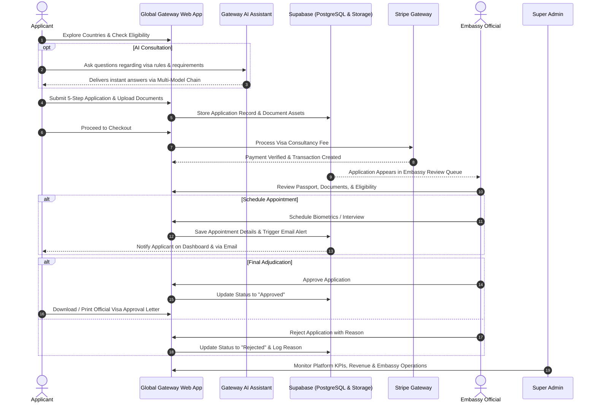

<div align="center">

# 🌐 Global Gateway
### Next-Gen Full-Stack Visa & Immigration Management Ecosystem

[](https://react.dev/)
[](https://vitejs.dev/)
[](https://tailwindcss.com/)
[](https://supabase.com/)
[](https://stripe.com/)
[](https://ai.google.dev/)
[](https://global-gateway-pro.vercel.app)
[](LICENSE)

<br />

**An enterprise-grade, full-lifecycle immigration platform delivering role-based portals for Visa Applicants, Embassy Officials, and Super Administrators. Engineered with a multi-model AI visa advisory engine, automated 5-step visa pipelines, dynamic embassy review queues, Stripe checkout, and real-time application tracking.**

[🚀 Explore Live Platform](https://global-gateway-pro.vercel.app) • [📖 Documentation](#-system-architecture) • [🤖 Gateway AI](#-gateway-ai-assistant--multi-model-fallback-engine) • [💼 Portals](#-portal-ecosystem--feature-breakdown) • [🛠️ Getting Started](#-getting-started)

</div>

---

## 📑 Table of Contents
- [Executive Overview](#-executive-overview)
- [🤖 Gateway AI Assistant (Highlighted Feature)](#-gateway-ai-assistant--multi-model-fallback-engine)
- [🏢 Portal Ecosystem & Feature Breakdown](#-portal-ecosystem--feature-breakdown)
  - [1. Applicant / User Portal](#1-applicant--user-portal)
  - [2. Embassy Official Portal](#2-embassy-official-portal)
  - [3. Super Administrator Portal](#3-super-administrator-portal)
- [🔄 End-to-End Application Workflow](#-end-to-end-application-workflow)
- [🏛️ System Architecture & Data Flow](#-system-architecture--data-flow)
- [⚡ Engineering & Performance Highlights](#-engineering--performance-highlights)
- [🛠️ Tech Stack Matrix](#-tech-stack-matrix)
- [📁 Repository File Tree](#-repository-file-tree)
- [🚀 Getting Started & Setup](#-getting-started)
  - [Prerequisites](#prerequisites)
  - [Local Installation](#local-installation)
  - [Environment Variables](#environment-variables)
  - [Supabase Edge Functions](#supabase-edge-functions)
- [👨‍💻 Author & Developer](#-author--developer)
- [📄 License](#-license)

---

## 🧭 Executive Overview

Navigating international travel and immigration involves fragmented processes, opaque consular requirements, and cumbersome document verification. **Global Gateway** resolves this friction by unifying every stakeholder into a singular, cohesive digital platform:

* **For Applicants:** A frictionless journey from interactive country discovery and eligibility verification to a guided 5-step application submission, biometric appointment tracking, official PDF approval issuance, and IELTS course enrollment.
* **For Consular & Embassy Teams:** Dedicated operational tools to formulate visa policies, audit document vaults, manage interview schedules, review applicant profiles, and execute real-time approvals or rejections.
* **For Platform Administrators:** Complete oversight with transactional ledgers, country catalog curation, embassy vetting, consultancy fee rules, and global analytics.

---

## 🤖 Gateway AI Assistant — Multi-Model Fallback Engine

At the heart of the platform sits **Gateway AI**, an enterprise-grade, conversational immigration counselor accessible 24/7 across the application. It guides users through complex visa regulations, country requirements, eligibility criteria, and fee structures in real-time.

```
                  ┌────────────────────────────────────────────────────────┐
                  │                 User Consultation Chat                 │
                  │             (GlobalLiveChat.jsx Interface)             │
                  └──────────────────────────┬─────────────────────────────┘
                                             │
                                             ▼
                  ┌────────────────────────────────────────────────────────┐
                  │       Security Middleware & Policy Validator            │
                  │   • Sliding-window IP Rate Limiter (20 req/min)        │
                  │   • 16 KB Body Size Cap & Prompt-Injection Shield      │
                  │   • RAG Context Injection (websiteKnowledgeForAi.js)   │
                  └──────────────────────────┬─────────────────────────────┘
                                             │
                       ┌─────────────────────┴─────────────────────┐
                       ▼                                           ▼
             Primary Endpoint                              Secondary Fallback
        [/api/visa-chat (Vercel)]                     [Supabase Edge Function]
                       │                                           │
       ┌───────────────┼───────────────┐                           │
       ▼               ▼               ▼                           ▼
 ┌───────────┐   ┌───────────┐   ┌───────────┐           ┌───────────────────┐
 │Tier 1:    │   │Tier 2:    │   │Tier 3:    │           │Self-Healing Deno  │
 │OpenRouter │──►│Groq LLaMA │──►│Google     │           │Edge Function with │
 │LLaMA 3.3  │   │3.3 70B    │   │Gemini 2.5 │           │Direct Model Chain │
 └───────────┘   └───────────┘   └───────────┘           └───────────────────┘
```

### Key Technical Capabilities of Gateway AI:
1. **Multi-Tier Fault-Tolerant Provider Chain:**
   - **Primary (Tier 1):** OpenRouter (`meta-llama/llama-3.3-70b-instruct`).
   - **Secondary (Tier 2):** Groq ultra-low-latency engine (`llama-3.3-70b-versatile`).
   - **Tertiary (Tier 3):** Google Gemini (`gemini-2.5-flash` / `gemini-1.5-flash`).
   - *If any provider encounters rate limits, downtime, or network timeout, the pipeline seamlessly cascades to the next provider without user interruption.*

2. **RAG & Domain-Injected Knowledge Base:**
   - Pre-injected system instructions (`websiteKnowledgeForAi.js`) grounding the assistant in platform-specific visa categories (Student, Tourist, Work, Business, Family, PR), exact application steps, embassy procedures, and refund policies.
   - Built-in prompt injection defense that politely rejects prompt override attempts and strictly redirects conversations to immigration guidance.

3. **Production Security & Edge Safeguards:**
   - In-memory sliding-window IP rate limiter preventing DDoS and abusive loops.
   - Payload size limitation (16 KB) and conversation truncation retaining the latest 10 conversational turns for optimal token budgets.
   - Response sanitization purging internal reasoning tokens (`<think>...</think>`) before UI rendering.

4. **Dynamic UI/UX Micro-Interactions:**
   - Multi-stage progressive loader visualizing live reasoning steps:
     `Analyzing inquiry...` ➔ `Checking visa regulations...` ➔ `Synthesizing recommendation...`
   - One-tap quick reply chips, auto-scrolling message streams, rich Markdown formatting, and minimize/expand states.

---

## 🏢 Portal Ecosystem & Feature Breakdown

### 1. Applicant / User Portal
* **Interactive Country Discovery:**
  - Dynamic destination catalog with search, continent filtering, and interactive **Leaflet Maps**.
  - Deep-dive country overviews detailing GDP, living cost index, climate, currencies, and visa categories.
* **Visa Process & Policy Guide:**
  - Clear checklists for required documentation, financial proof thresholds, expected processing turnarounds, and government vs. consultancy fees.
* **5-Step Visa Application Pipeline:**
  1. **Personal Information:** Contact details, residence, and demographic validation.
  2. **Passport Verification:** Travel credentials, issue/expiry dates, and issuing authority.
  3. **Visa Classification:** Category selection (Student, Tourist, Work, Business, Family, Permanent Resident).
  4. **Document Upload Vault:** Multi-file upload directly into private **Supabase Storage** buckets with client-side previews and mime-type validation.
  5. **Review & Submission:** Final application audit before submission.
* **Integrated Stripe Checkout:**
  - Secure payment processing for both visa consultancy fees and training courses with automated receipt generation.
* **Real-Time Application Dashboard:**
  - Visual status timeline: `Pending` ➔ `Under Review` ➔ `Appointment Scheduled` ➔ `Approved` / `Rejected`.
  - Embassy officer notes and direct updates.
  - Appointment scheduling inspector (Date, Time slot, Embassy location, and guidelines).
  - One-click official **PDF Approval Letter generation** (`jspdf` + `jspdf-autotable`) and browser printing (`react-to-print`).
* **IELTS & Language Academy:**
  - Comprehensive course catalog for IELTS/PTE preparation, syllabus breakdowns, shopping cart, and instant enrollment.

---

### 2. Embassy Official Portal
* **Embassy Registration & Onboarding:**
  - Dedicated consular onboarding workflow with country association, official credential verification, and embassy contact configuration.
* **Dynamic Visa Policy Management:**
  - Officers can add, update, and tailor visa types, mandatory document requirements, eligibility criteria, and consular fees in real time.
* **Consular Application Review Queue:**
  - Comprehensive dashboard categorizing submissions by status (`Pending`, `Under Review`, `Approved`, `Rejected`).
  - Detailed applicant inspection: full personal background, passport data, and high-resolution submitted documents.
* **Interview & Biometrics Appointment Scheduler:**
  - Consular officials can schedule physical interviews and biometric appointments directly with selected dates, times, and venue instructions.
  - Automatically triggers email notifications to applicants via transactional email edge functions.
* **Consular Adjudication Workflow:**
  - Formal **Approval** with system-generated official approval letters.
  - Formal **Rejection** with categorized mandatory reason logging for applicant transparency.
* **Embassy Analytics & Insights:**
  - Interactive **Chart.js** visualizations tracking application volume, acceptance vs. rejection ratios, and average turnaround days.

---

### 3. Super Administrator Portal
* **System Executive Dashboard:**
  - Real-time KPIs covering total platform revenue, application throughput, registered embassies, active users, and system conversion rates.
* **Embassy Onboarding & Governance:**
  - Review pending embassy partner applications, audit official credentials, and grant or revoke portal access.
* **Global Country & Visa Catalog Engine:**
  - Add and curate destination nations, currencies, living metrics, and supported visa classifications.
* **Platform Fee & Charges Management:**
  - Centralized control over platform consultancy charges, service fees, and payment gateway configurations.
* **User & Role Administration:**
  - Comprehensive RBAC management, viewing user profiles, transaction history, and submitted applications.
* **Course & Academy Management:**
  - Add new immigration preparation courses, manage syllabi, instructors, and pricing tiers.
* **Transaction Ledger & Inquiries:**
  - Real-time audit log of all Stripe transactions, payment statuses, and user support contact messages.

---

## 🔄 End-to-End Application Workflow



---

## 🏛️ System Architecture & Data Flow

Global Gateway adopts a decoupled, modern architecture engineered for high availability, zero cold-start latency, and responsive data synchronization:

```
┌────────────────────────────────────────────────────────────────────────┐
│                        CLIENT LAYER (React 19)                         │
│  • React Router v7   • Tailwind CSS v4      • Framer Motion & GSAP    │
│  • Redux Toolkit     • Zustand (Cart State) • TanStack Query v5       │
└──────────────────┬─────────────────────────────────┬───────────────────┘
                   │                                 │
                   ▼                                 ▼
┌──────────────────────────────────────┐   ┌─────────────────────────────┐
│       SERVERLESS & EDGE APIs         │   │      PAYMENTS INFRA         │
│  • /api/visa-chat (Vercel Serverless)│   │  • Stripe Checkout Sessions │
│  • Supabase Edge Functions (Deno):   │   │  • Payment Verification     │
│    - send-transactional-email        │   │  • Transaction Logging      │
│    - visa-support-chat               │   └─────────────────────────────┘
└──────────────────┬───────────────────┘
                   │
                   ▼
┌────────────────────────────────────────────────────────────────────────┐
│                   SUPABASE BACKEND-AS-A-SERVICE                        │
│  • PostgreSQL with Row Level Security (RLS)                            │
│  • Supabase Auth (JWT & Role-Based Access Control)                     │
│  • Supabase Storage (Encrypted Document & Asset Buckets)               │
│  • Realtime Subscriptions & Postgres Triggers                          │
└────────────────────────────────────────────────────────────────────────┘
```

---

## ⚡ Engineering & Performance Highlights

* **Cinematic Zero-Jitter Hero Preloader:**
  Custom preloading routine executing off-main-thread image decoding using the browser `HTMLImageElement.decode()` API, eliminating render-blocking paint lag upon home banner refresh.
* **Dynamic Chunk Healing (`safeLazy`):**
  A custom lazy-loading wrapper that intercepts stale Vite production bundle chunk hashes during continuous deployment cycles and seamlessly reloads the viewport once to recover updated assets without crashing.
* **Dual State Architecture:**
  Server state managed with **TanStack Query v5** (stale-while-revalidate, query deduplication, optimistic cache updates) paired with **Redux Toolkit** for session security and **Zustand** for lightweight local cart manipulation.
* **Strict Role-Based Routing (`ProtectedRoute`):**
  Role verification intercepting unauthorized portal entries (`user`, `embassy`, `admin`), automatically safeguarding admin screens and embassy queues.
* **Automated Client-Side PDF Generation:**
  Zero-backend overhead document rendering generating high-resolution visa approval letters with official stamps, dates, and application references using `jspdf` and `jspdf-autotable`.

---

## 🛠️ Tech Stack Matrix

| Category | Technology | Purpose |
| :--- | :--- | :--- |
| **Frontend Core** | **React.js 19** | Modern component architecture utilizing concurrent features |
| **Bundler & Tooling** | **Vite 7** | Lightning-fast HMR and optimized production bundling |
| **Styling & Design** | **Tailwind CSS 4** | Utility-first, next-generation styling engine |
| **Animations** | **Framer Motion 12 & GSAP 3** | Fluid page transitions, modal choreographies, and loaders |
| **Smooth Scrolling** | **Lenis 1.3** | Hardware-accelerated smooth inertia scrolling |
| **State Management** | **Redux Toolkit & Zustand** | Global auth sessions, loading states, and cart management |
| **Server State** | **TanStack Query v5** | Declarative data fetching, cache synchronization, and mutations |
| **Database & Auth** | **Supabase (PostgreSQL)** | Relational database, secure Auth, and Row Level Security |
| **Cloud Storage** | **Supabase Storage** | Encrypted applicant document and passport upload buckets |
| **Edge Functions** | **Deno / Supabase Edge** | Serverless transactional emails and fallback AI services |
| **Serverless API** | **Vercel Serverless Functions** | Multi-model `/api/visa-chat` gateway endpoint |
| **Artificial Intelligence** | **OpenRouter, Groq, Gemini** | Multi-model LLM fallback chain powering **Gateway AI** |
| **Payment Gateway** | **Stripe API** | Secure credit/debit card and international payment checkout |
| **Document Generation**| **jsPDF & react-to-print** | Instant consular approval letters and printable receipts |
| **Mapping & Geospatial**| **Leaflet & React-Leaflet** | Interactive global destination map and embassy locations |
| **Data Visualization** | **Chart.js & React-Chartjs-2** | Visual analytics dashboards for Admins and Embassies |

---

## 📁 Repository File Tree

```bash
Global-Gateway/
├── api/
│   └── visa-chat.js               # Vercel Serverless Function: Multi-model AI Chat Gateway
├── public/                        # Static assets, branding, and hero images
│   ├── Gateway AI.png             # Official Gateway AI brand badge
│   ├── Slider-front1.jpg          # Cinematic hero backdrop
│   └── ...
├── src/
│   ├── api/                       # API clients and endpoints
│   ├── assets/                    # Project styling assets and icons
│   ├── Components/
│   │   ├── Auth/                  # Login, registration, and route guards
│   │   ├── Embassy/               # Consular review modals, schedulers, and widgets
│   │   ├── admin/                 # Admin data tables, metrics cards, and controls
│   │   ├── user/                  # Country cards, 5-step application forms, and cart
│   │   ├── GlobalLiveChat.jsx     # Production Gateway AI widget component
│   │   └── Loading.jsx            # Cinematic splash screen preloader
│   ├── Pages/
│   │   ├── admin/                 # Super Admin pages (Analytics, Users, Countries, Visas)
│   │   ├── embassy/               # Embassy pages (Dashboard, Applications, Policies, Review)
│   │   ├── user/                  # Applicant pages (Home, Countries, Application Form, Checkout)
│   │   └── verification/          # Email and credential confirmation handlers
│   ├── Redux/
│   │   ├── Slice/                 # Auth, transaction, loading, and order slices
│   │   └── store.js               # Centralized Redux store configuration
│   ├── Routing/
│   │   └── Routing.jsx            # React Router v7 routes with RBAC protection & safeLazy
│   ├── supabase/                  # Supabase client instantiation
│   ├── tanstack/                  # React Query query hooks and mutations
│   ├── util/
│   │   ├── chat/                  # AI prompt engine, message sanitizer, & fallback logic
│   │   ├── printUtils.js          # jsPDF approval letter generator
│   │   └── heroBannerPreload.js   # Off-thread image preloader
│   ├── App.jsx                    # Root application component with dynamic background hooks
│   ├── index.css                  # Tailwind CSS 4 directives & global variables
│   └── main.jsx                   # React 19 entry point
├── supabase/
│   └── functions/
│       ├── send-transactional-email/  # Deno Edge Function: Automated SMTP alerts
│       └── visa-support-chat/         # Deno Edge Function: AI Chat secondary fallback
├── .env.example                   # Environment variable template
├── package.json                   # Project dependencies and script declarations
├── vercel.json                    # Vercel routing and function configuration
└── vite.config.js                 # Vite 7 build configuration
```

---

## 🚀 Getting Started

### Prerequisites
* **Node.js**: v18.0.0 or higher
* **npm** or **yarn** / **pnpm**
* A free **[Supabase](https://supabase.com/)** account with a PostgreSQL project
* A **[Stripe](https://stripe.com/)** account for testing payment workflows
* API Keys for AI Providers:
  - **[OpenRouter](https://openrouter.ai/)** (Primary LLM)
  - **[Groq](https://console.groq.com/)** (Secondary LLM)
  - **[Google AI Studio](https://aistudio.google.com/)** (Tertiary LLM)

---

### Local Installation

1. **Clone the repository:**
   ```bash
   git clone https://github.com/SubhradeepNathGit/Global-Gateway-Visa-Immigration-Consultant-Application.git
   cd Global-Gateway-Visa-Immigration-Consultant-Application
   ```

2. **Install dependencies:**
   ```bash
   npm install
   ```

3. **Configure Environment Variables:**
   Create a `.env` file in the root directory by duplicating `.env.example`:
   ```bash
   cp .env.example .env
   ```

4. **Start the local development server:**
   ```bash
   npm run dev
   ```
   Open [http://localhost:5173](http://localhost:5173) in your browser.

---

### Environment Variables

Configure your `.env` file with the following variables:

```env
# Supabase Configuration
VITE_SUPABASE_URL=https://your-project-id.supabase.co
VITE_SUPABASE_ANON_KEY=your-supabase-anon-key

# Application & Checkout Endpoint
VITE_CHECKOUT_ENDPOINT=http://localhost:5173

# AI Assistant Keys (Vercel Serverless / Backend Environment)
OPENROUTER_API_KEY=sk-or-v1-your-openrouter-key
OPENROUTER_MODEL=meta-llama/llama-3.3-70b-instruct:free
GROQ_API_KEY=gsk_your-groq-key
GROQ_MODEL=llama-3.3-70b-versatile
GEMINI_API_KEY=AIzaSy-your-gemini-key
GEMINI_MODEL=gemini-2.5-flash
```

---

### Supabase Edge Functions

To deploy the automated transactional email dispatcher and Edge AI fallback:

```bash
# Link your Supabase Project
npx supabase link --project-ref your-project-id

# Set Server-Side Secrets
npx supabase secrets set GMAIL_USER=your-email@gmail.com
npx supabase secrets set GMAIL_APP_PASSWORD=your-app-password
npx supabase secrets set EMAIL_FROM="Global Gateway <your-email@gmail.com>"
npx supabase secrets set PUBLIC_APP_URL=https://global-gateway-pro.vercel.app

# Deploy Functions
npx supabase functions deploy send-transactional-email
npx supabase functions deploy visa-support-chat
```

---

## 👨‍💻 Author & Developer

<div align="center">

### **Subhradeep Nath**
**Full-Stack Software Developer**

[](https://linkedin.com/in/subhradeep-nath-dev)
[](https://github.com/SubhradeepNathGit)
[](https://subhradeepnathportfolio.vercel.app)
[](mailto:subhradeepnathprofessional@gmail.com)

*Passionate about engineering scalable web architectures, modern reactive interfaces, and intelligent AI-powered digital experiences.*

</div>

---

## 📄 License

This project is licensed under the **MIT License** — feel free to inspect, modify, and build upon this project for educational or commercial purposes.

<div align="center">
  <sub>Built with ❤️ by Subhradeep Nath • © 2026 Global Gateway</sub>
</div>
